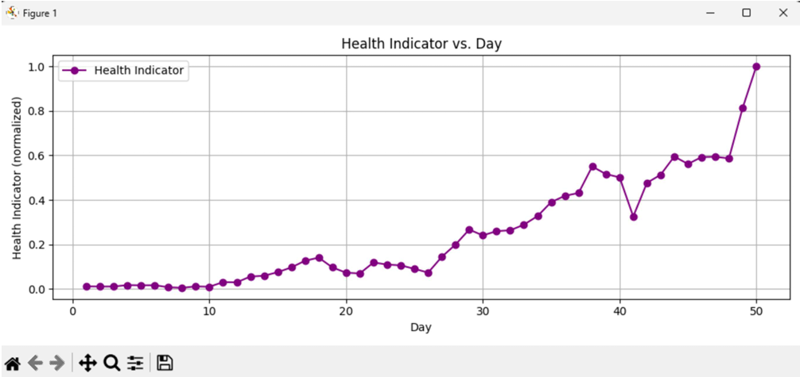
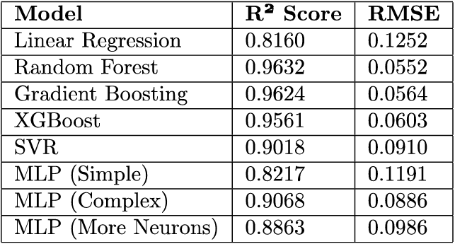

# Project Overview
This project implements a digital twin for a rolling element bearing using vibration data, signal processing, and machine learning to estimate fault severity and visualize health in real time. The system combines feature‑based health indicators, an ML regression model, a Fusion 360 add‑in, and a Raspberry Pi communication pipeline to support predictive maintenance of rotating machinery.

# Data and Feature Engineering
## Data Collection
* High‑frequency vibration data (sampling rate 97,656 Hz) was collected over 50 days from a bearing in a rotating machine.
* Each day’s signal was split into 1‑second segments, and features were extracted per segment, then averaged per day to track degradation trends over time.

## Extracted Features
* Time‑domain features: RMS, peak, crest factor, standard deviation, kurtosis, skewness, and peak‑to‑peak amplitude were computed to characterize amplitude distribution and impulsiveness.
* Frequency/spectral features: FFT peak, spectral centroid, band energy ratio (low vs high bands), envelope spectrum peak (via Hilbert transform), and entropy were computed to capture frequency content and impact‑like behavior.

# Health indicator and Machine Learning
## Health Indicator Design
* Trend analysis showed kurtosis and envelope spectrum peak increased significantly after around Day 26, matching expected bearing fault development.
* These two features were normalized to, smoothed with a 3‑day rolling mean, and combined using an equal‑weight average to form a composite health indicator that tracks degradation over the 50‑day period.

## Model Selection and Performance
* Several regression models were evaluated (Linear Regression, Random Forest, Gradient Boosting, XGBoost, SVR, and multiple MLP variants) using R² and RMSE as metrics.
* Random Forest achieved the best performance with R² ≈ 0.96 and RMSE ≈ 0.055, and was selected as the primary model for predicting fault severity and health indicator values.

# Digital Twin Visualisation
## Fusion 360 Health Visualisation
* A Fusion 360 add in using the Fusion 360 API was developed to read the computed health indicator from file and update a bearing CAD model in real time.
* The add‑in maps health indicator ranges to discrete health levels (1–6) with color coding (green to red), and updates a status bar and model appearance to reflect the current bearing condition.

## Real-Time Dashboard
* A dedicated Python-based dashboard displays a rotating bearing graphic, real‑time vibration plots, and a live data section showing feature values and health indicator for each time step.
* Color‑coded alerts (green, yellow, red) provide instant feedback on normal, warning, and critical states, enabling quick maintenance decisions.
)

# Edge Communication and Streaming
## Raspberry Pi Integration
* A Python script uses SSH (Paramiko) and SFTP to remotely connect to a Raspberry Pi, run a feature‑extraction script, and download the generated CSV file (e.g., all_features.csv).
* The script then simulates a live data stream locally by reading the CSV row‑by‑row in a background thread and writing it to a new file with time delays, emulating continuous sensor data.

## Role in the Digital Twin
* This communication pipeline allows the digital twin to be driven by remote edge devices, enabling automated data acquisition and near real‑time health updates in the visualization environment.
* Together with the health indicator and Random Forest model, it forms an end‑to‑end framework for data‑driven bearing monitoring and digital twin deployment in rotating machinery.
